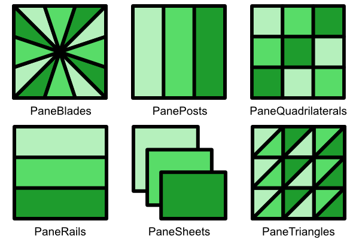

# QuickVectors.Core.FSharp

# Pane Form

Defines a form which can be used in a pane pattern.

- The [Pane Form Type](#the-paneform-type)
- [Discriminated Union Identity Values](#discriminated-union-identity-values)
- [Exception-free Processing](#exception-free-processing)
- [Issues, Questions, and Suggestions](#issues-questions-and-suggestions)

## The Pane Form Type

The `PaneForm` **type** defines a discriminated union used to specify the form of a pane pattern.

The cases are (in aphabetical order):

| Case Name                     | Pane Is Made From                                                     |
| ----------------------------- | --------------------------------------------------------------------- |
| **PaneBlades**                | Triangles which radiate from a centre-point (like a fan) **1*         |
| **PanePosts**                 | Tall shapes (like abutted fence posts) **2*                           |
| **PaneQuadrilaterals** **3*   | Quadrilaterals (like large stained glass pieces)                      |
| **PaneRails**                 | Wide shapes (like stacked railway rails) **2*                                |
| **PaneSheets**                | Large overlapping shapes (like stacked paper sheets)                  |
| **PaneTriangles**             | Triangles (like small stained glass pieces)                           |

- **1* : The position of the centre-point can be defined.
- **2* : Shapes will not overlap.
- **3* : The default case.

To specify a pane form simply supply its name, such as `PaneForm.PaneTriangles`.

## Discriminated Union Identity Values

Functions are available for converting to and from POCO types and DU cases.
See the [overview documentation](000-Overview.md "Package overview") for more information about these.

## Exception-free Processing

Exception-free processing versions - FailSafe, Option, and Result - of some functions are available.
See the [overview documentation](000-Overview.md "Package overview") for more information about these.

## Issues, Questions, and Suggestions

You can visit the *[QuickVectors.FSharp](https://github.com/GarryPatchett/QuickVectors.FSharp "Home page for the QuickVectors project")* GitHub repository to report issues, 
ask questions, or make suggestions. You can also read about the changes across different versions in the release notes there.