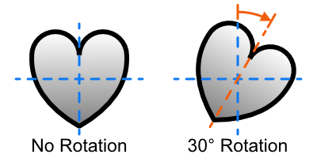

# QuickVectors.Patterns.FSharp

# Ranges

A range is often specified in the various Options types (see documentation elsewhere).

Since a lot of these ranges are similar, with only some small differences, they are documented first
in general (to avoid repeated information) and then below for specific details. 

- [Shared Functionality](#shared-functionality)
    - [Limits](#limits)
    - [Construction](#construction)
    - [Deconstruction](#deconstruction)
    - [Variations](#variations)
    - [Conversion](#conversion)
- The [Shape Dimension Range](#the-shape-dimension-range) with [ready-made ranges](#ready-made-shape-dimension-ranges)
- The [Geometry Modifier Range](#the-geometry-modifier-range) with [ready-made ranges](#ready-made-geometry-modifier-ranges)
- The [Rotation Modifier Range](#the-rotation-modifier-range) with [ready-made ranges](#ready-made-rotation-modifier-ranges)
- The [Number Of Vertices Range](#the-number-of-vertices-range) with [ready-made ranges](#ready-made-number-of-vertices-ranges)
- The [Stroke Width Range](#the-stroke-width-range) with [ready-made ranges](#ready-made-stroke-width-ranges)
- The [Spread Rotation Range](#the-spread-rotation-range) with [ready-made ranges](#ready-made-spread-rotation-ranges)
- [Issues, Questions, and Suggestions](#issues-questions-and-suggestions)

## Shared Functionality

### Limits

Some values are provided to give the limits of a range, and these are:

- `minimum` : Returns the minimum value of the range - the lowest value that can be set;
- `maximum` : Returns the maximum value of the range - the highest value that can be set.

For example, `GeometryModifierRange.minimum` will return the minimum possible value for a geometry modifier range.

These values can be useful in interactive environments where you need to set the limits for a control.

### Construction

A range can be either a single-value range or a double-value range, where:

- a single-value range is one which was specified with either just one value or two values which were equal;
- a double-value range is one where the two values specified were not equal.

The value(s) give the low and high limits of the range (always inclusive) but do not need to be specified
in that order during construction as they will be sorted internally before the range is created.

Each range will clamp the input values to certain minimum and maximum values.

A number of functions are supplied for the construction of a range, and these are:

- `fromSingleInt` or `fromSingleFloat`
    : Create a single-value range from one value;
- `fromInts` or `fromFloats`
    : Create a double-value range from two values - if the values are equal then a single-value range is created.

Any particular range will have either int- or float-based constructors but not both.

A range is usually accompanied by a profile (see documentation elsewhere) which is used to choose values within the range.
For single-value ranges this profile is ignored as there is only one value to choose from.

The type member `AsDisplayString` is available to get the short display string for each range.
For example, `GeometryModifierRange.tenNinety.AsDisplayString` will return "GeometryModRange(10,90)".

When a range is printed to the screen the output will be the output from the `AsDisplayString` member.

### Deconstruction

Some functions are supplied for the deconstruction of a range, and these are:

- `lowValue` : Returns the low value of the range - the lower limit - same as the high value for single-value ranges;
- `highValue` : Returns the high value of the range - the higher limit - same as the low value for single-value ranges.

### Variations

Ranges, once constructed, cannot be modified. If you need to use different values then just create a new range.
This gets around the confusing possibility where, for example, a new high value is specified which is lower than
the existing low value.

### Conversion

Each range provides a `toDenormalisationRange` function which creates a DenormalisationRange which is appropriate to the limits of the range.

You would not normally need to use this manually but it's there if you do.

## The Shape Dimension Range

The `ShapeDimensionRange` **type** and **module** specifies a range of values for a single shape dimension.

The values are specified by floats and they are clamped to the range `minimum` to `maximum` (inclusive).

The width and height of a shape are both specified by a shape dimension and so a different shape dimension range can
be used for each, or the same one for both.

When a shape dimenstion range is printed to the screen
- for a single-value range the output will be `ShapeDimOnly(V)`, where `V` is the single value, or;
- for a double-value range the output will be `ShapeDimRange(L,H)`, where `L` is the low value and `H` is the high value.

### Ready-made Shape Dimension Ranges

Various ready-made ranges are available, and these are:

- `tenNinety` : A double-value range from 10.0 to 90.0;
- `twentyEighty` : A double-value range from 20.0 to 80.0;
- `thirtySeventy` : A double-value range from 30.0 to 70.0;
- `fiftyFifty` : A single-value range of 50.0 only;
- `fiftyAndAbove` : A double-value range from 50.0 to 100.0;
- `fullRange` : A double-value range from 1.0 to 100.0;
- `bothMaximum` : A single-value range of 100.0.

## The Geometry Modifier Range

The `GeometryModifierRange` **type** and **module** specifies a range of values which can be used for the modification of shape geometry.

The values are specified by floats and they are percentages which are clamped to the range `minimum`(%) to `maximum`(%) (inclusive).

The generated geometry modifier values determine how some shapes will have they geometries modified.

For example, they specify how large the hole is in an ellipse ring, or the thickness of the beams of a cross.

The closer the values are to each other the subtler the effect, in most cases.

Geometry modification only applies to some shapes and will be ignored where not appropriate.

Specifiying the minimum or maximum value in the range can sometimes result in the shape not being visible.
For example, if the hole of a ring is 100% the size of the ring then there's not really much of a ring remaining.

Some experimentation may be needed to see how the geometry modification applies to the different shapes.

When a geometry modifier range is printed to the screen
- for a single-value range the output will be `GeometryModOnly(V)%`, where `V` is the single value, or;
- for a double-value range the output will be `GeometryModRange(L,H)%`, where `L` is the low value and `H` is the high value.

### Ready-made Geometry Modifier Ranges

Various ready-made ranges are available, and these are:

- `tenNinety` : A double-value range from 10.0 to 90.0;
- `twentyEighty` : A double-value range from 20.0 to 80.0;
- `thirtySeventy` : A double-value range from 30.0 to 70.0;
- `fiftyFifty` : A single-value range of 50.0 only;
- `fullRange` : A double-value range from 0.0 to 100.0.

## The Rotation Modifier Range

The `RotationModifierRange` **type** and **module** specifies a range of values which can be used for shape rotation.

The values are specified by floats and they are degrees of rotation which are clamped to the range `minimum` to `maximum` (inclusive).

A positive rotation is a clockwise rotation.

If the range is a single-value range with a value of zero - which could have been specified with two zero values - then no rotation will be applied.

When a rotation modifier range is printed to the screen:
- for a single-value range the output will be `RotationOnly(V)`, where `V` is the single value, or;
- for a double-value range the output will be `RotationRange(L,H)`, where `L` is the low value and `H` is the high value, or;
- if no rotation will be applied then the output will be `NoRotation`.

### Ready-made Rotation Modifier Ranges

Various ready-made ranges are available, and these are:

- `noRotation` : A single-value range of 0.0 only;
- `bothMinimum` : A single-value range of -180.0 only;
- `fifteens` : A double-value range of -15.0 to +15.0;
- `thirties` : A double-value range of -30.0 to +30.0;
- `fourtyFives` : A double-value range of -45.0 to +45.0;
- `nineties` : A double-value range of -90.0 to +90.0;
- `oneThirtyFives` : A double-value range of -135.0 to +135.0;
- `fullRange` : A double-value range of -180.0 to +180.0;
- `bothMaximum` : A single-value range of +180.0 only.

## The Number Of Vertices Range

The `NumberOfVerticesRange` **type** and **module** specifies a range of values for the number of vertices that some shapes have.

The values are specified by ints (the number of vertices is always a whole number) and they are clamped to the range `minimum` to `maximum` (inclusive).

The number of vertices is fairly obvious for most shapes, such as polygons, but for other shapes it is the number of 
control points which have been used to draw the shapes, e.g. flowers, blobs, etc. 

When a number of vertices range is printed to the screen
- for a single-value range the output will be `VerticesOnly(V)`, where `V` is the single value, or;
- for a double-value range the output will be `VerticesRange(L,H)`, where `L` is the low value and `H` is the high value.

### Ready-made Number Of Vertices Ranges

Various ready-made ranges are available, and these are:

- `bothMinimum` : A single-value range of 3 only;
- `lowValues` : A double-value range of 3 to 8;
- `pentToDec` : A double-value range of 5 to 10;
- `middleValues` : A double-value range of 9 to 14;
- `highValues` : A double-value range of 15 to 20;
- `fullRange` : A double-value range of 3 to 20;
- `bothMaximum` : A single-value range of 20 only.

## The Stroke Width Range

The `StrokeWidthRange` **type** and **module** specifies a range of values for a stroke width.

The values are specified by floats and they are clamped to the range `minimum` to `maximum` (inclusive).

When a stroke width range is printed to the screen
- for a single-value range the output will be `StrokeWidthOnly(V)`, where `V` is the single value, or;
- for a double-value range the output will be `StrokeWidthRange(L,H)`, where `L` is the low value and `H` is the high value.

### Ready-made Stroke Width Ranges

Various ready-made ranges are available, and these are:

- `one` : A single-value range of 1.0;
- `fullRange` : A double-value range from 0.0 to 25.0.

## The Spread Rotation Range

The `SpreadRotationRange` **type** and **module** specifies a range of values which can be used for spread rotation.

The values are specified by floats and they are degrees of rotation which are clamped to the range `minimum` to `maximum` (inclusive).

A negative rotation is an anti-clockwise rotation.

If the range is a single-value range with a value of zero - which could have been specified with two zero values - then no rotation will be applied.

When a rotation modifier range is printed to the screen:
- for a single-value range the output will be `SpreadRotationOnly(V)`, where `V` is the single value, or;
- for a double-value range the output will be `SpreadRotationRange(L,H)`, where `L` is the low value and `H` is the high value.

### Ready-made Spread Rotation Ranges

Various ready-made ranges are available, and these are:

- `noRotation` : A single-value range of 0.0 only;
- `fifteens` : A double-value range of -15.0 to +15.0;
- `thirties` : A double-value range of -30.0 to +30.0;
- `fourtyFives` : A double-value range of -45.0 to +45.0;
- `nineties` : A double-value range of -90.0 to +90.0;
- `oneThirtyFives` : A double-value range of -135.0 to +135.0;
- `fullRange` : A double-value range of -180.0 to +180.0.

## Issues, Questions, and Suggestions

You can visit the *[QuickVectors.FSharp](https://github.com/GarryPatchett/QuickVectors.FSharp "Home page for the QuickVectors project")* GitHub repository to report issues, 
ask questions, or make suggestions. You can also read about the changes across different versions in the release notes there.