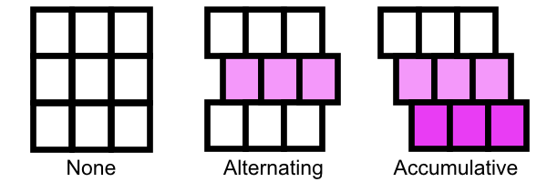

# QuickVectors.Patterns.FSharp

# Grid Offset

This type lets you define the offset of the cells of a grid, where appropriate.

- The [Grid Offset Type](#the-grid-offset-type)
    - [Construction](#construction)
    - [Deconstruction](#deconstruction)
    - [Variations](#variations)
    - [Code Examples](#code-examples)
- [Discriminated Union Identity Values](#discriminated-union-identity-values)
- [Exception-free Processing](#exception-free-processing)
- [Issues, Questions, and Suggestions](#issues-questions-and-suggestions)

## The Grid Offset Type

The `GridOffset` **type** defines a discriminated union which speficies the offset of the cells
of a grid which is used by some patterns.

The cases are:

- `AlternatingOffset` : An alternating offset;
- `AccumulativeOffset` : An accumulative offset.

You cannot create these cases yourself and should use the construction functions instead.



### Construction

The construction functions are:

- `alternating` : Creates a grid offset where each odd-numbered row is offset;
- `accumulative` : Creates a grid offset where each row is offset from the row above.

The amount of offset, for either type of offset, is clamped to the range 0.0 to 200.0 (inclusive).

> **Note:** The top row is row zero (even), the next row down is row one (odd), etc.

When a grid offset is printed to the screen the output will be:
- `GridOffset(AltX)` : Where `Alt` shows that it's an alternating offset and `X` is the amount of offset;
- `GridOfffset(AccX)` : Where `Acc` shows that it's an accumulative offset and `X` is the amount of offset.

The type member `AsDisplayString` is available to get the short display string for a grid route as mentioned above.

### Deconstruction

The deconstruction functions are:

- `amount`
    : Returns the amount of offset (often used with the `toInt` function).

### Variations

A grid offset, once constructed, cannot be modified. If you need to use different values then just create a new grid offset.

### Code Examples

```fsharp 
let alternating = GridOffset.alternating 50 // -> GridOffset(Alt50)

let accumulative = GridOffset.accumulative 25 // -> GridOffset(Acc25)
```

## Discriminated Union Identity Values

Functions are available for converting to and from POCO types and DU cases.
See the [overview documentation](000-Overview.md "Package overview") for more information about these.

For the type described above there is no `defaultCase` value.

> **Note:** The `fromInts` (plural) function requires two values, the first is the identity and the second is the amount.

## Exception-free Processing

Exception-free processing versions - Option and Result - of some functions are available.
See the [overview documentation](000-Overview.md "Package overview") for more information about these.

For the type described above there is no `FailSafe.fromInts` function and it is recommended
that you use the `Option.fromInts` function instead.

## Issues, Questions, and Suggestions

You can visit the *[QuickVectors.FSharp](https://github.com/GarryPatchett/QuickVectors.FSharp "Home page for the QuickVectors project")* GitHub repository to report issues, 
ask questions, or make suggestions. You can also read about the changes across different versions in the release notes there.