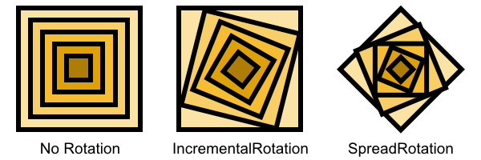

# QuickVectors.Patterns.FSharp

# Centric Rotation Definition

This type lets you define how centrics will be rotated.

- The [Centric Rotation Definition Type](#the-centric-rotation-definition-type)
    - [Cases](#cases)
    - [Construction](#construction)
    - [Deconstruction](#deconstruction)
    - [Variations](#variations)
    - [Ready-made Centric Rotation Definitions](#ready-made-centric-rotation-definitions)
- [Issues, Questions, and Suggestions](#issues-questions-and-suggestions)

## The Centric Rotation Definition Type

The `CentricRotationDefinition` **type** defines a discriminated union which is used to specify how centrics will be rotated.

### Cases 

The cases of the centric rotation definition are as follows:

| Case  Name                | Modifiers                 | All Centrics Will Be Rotated...                                   |
| ------------------------- | ------------------------- | ----------------------------------------------------------------- |
| **IncrementalRotation**   | Amount ([IncrementalRotationAmount](130-IncrementalRotationAmount.md "The IncrementalRotationAmount type and module"))                   | Incrementally by the specified amount                             |
| **SpreadRotation**        | Range ([SpreadRotationRange](010-Ranges.md "The SpreadRotationRange type and module")), Profile ([Profile](../QuickVectors.Core.FSharp/080-Profile.md "The Profile type and module"))           | Through a range of rotations via the specified profile            |



Below are examples of centric rotation definitions:

```fsharp 
let oneTenth = 
    IncrementalRotation(Amount = IncrementalRotationAmount.fromFloat 0.1)
    // -> IncrementalRotation IncrementalRotation(0.1)

let fourtyFivesLinear = 
    SpreadRotation(Range = SpreadRotationRange.fourtyFives, Profile = Profile.Linear)
    // -> SpreadRotation (SpreadRotationRange(-45,45), Linear)
```

### Construction

There are no construction functions, just create a case as shown above.

### Deconstruction

There are no deconstruction functions for the type itself but you can deconstruct each field with the
deconstruction function appropriate for the type of that field.

### Variations 

There are no functions for varying the values of the type; if you need a new definition then just create a different one.

## Ready-made Centric Rotation Definitions

The ready-made centric rotation definitions available are:

- **Incremental**

    - `oneTenth` : One tenth of a degree clockwise;
    - `oneHalf` : One half of a degree clockwise;
    - `one` : One degree clockwise;
    - `two` : Two degrees clockwise;
    - `three` : Three degrees clockwise;
    - `five` : Five degrees clockwise;
    - `ten` : Ten degrees clockwise.

- **Spread**

    - `fourtyFivesLinear` : In a linear fashion from -45.0 to +45.0 degrees clockwise;
    - `ninetiesLinear` : In a linear fashion from -90.0 to +90.0 degrees clockwise;
    - `fullRangeLinear` : In a linear fashion from -180.0 to +180.0 degrees clockwise.

## Issues, Questions, and Suggestions

You can visit the *[QuickVectors.FSharp](https://github.com/GarryPatchett/QuickVectors.FSharp "Home page for the QuickVectors project")* GitHub repository to report issues, 
ask questions, or make suggestions. You can also read about the changes across different versions in the release notes there.