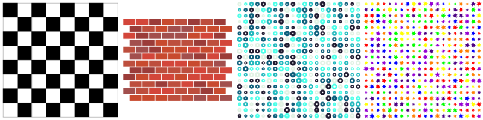

# QuickVectors.Patterns.FSharp

# Shape Grid

This type lets you define a pattern which is based around shapes aligned to a grid.

- The [Shape Grid Type](#the-shape-grid-type)
    - [Fields](#fields)
    - [Construction](#construction)
    - [Deconstruction](#deconstruction)
    - [Variations](#variations)
    - [Generation](#generation)
    - [Ready-made Shape Grid Patterns](#ready-made-shape-grid-patterns)
- [Issues, Questions, and Suggestions](#issues-questions-and-suggestions)



## The Shape Grid Type

The `ShapeGrid` **type** defines a record which is used to specify a shape grid pattern.

### Fields 

The fields of the shape grid pattern are as follows:

| Field Name                | Type                                                                                              | Purpose / Defines                                         |
| ------------------------- | ------------------------------------------------------------------------------------------------- | --------------------------------------------------------- |
| **RandomSeed**            | [RandomSeed](../QuickVectors.Core.FSharp/010-RandomSeed.md "The RandomSeed type and module")      | Random seed used to generate random numbers               |
| **Shape**                 | [Shape](../QuickVectors.Core.FSharp/020-Shape.md "The Shape type and module")                     | Shape to be used in the pattern                           |
| **ShapeSize**             | [ShapeSizeDefinition](300-ShapeSizeDefinition.md "The ShapeSizeDefinition type and module")       | Size(s) of the shapes which will be generated             |
| **Geometry**              | [GeometryDefinition](310-GeometryDefinition.md "The GeometryDefinition type and module")          | Geometries of the shapes                                  |
| **Rotation**              | [RotationDefinition](320-RotationDefinition.md "The RotationDefinition type and module")          | Rotations of the shapes                                   |
| **Vertices**              | [VerticesDefinition](330-VerticesDefinition.md "The VerticesDefinition type and module")          | Vertices of the shapes                                    |
| **GridSize**              | [GridSize](../QuickVectors.Core.FSharp/100-GridSize.md "The GridSize type and module")            | Size of the grid                                          |
| **GridRoute**             | [GridRoute](../QuickVectors.Core.FSharp/090-GridRoute.md "The GridRoute type and module")         | Route by which the cells of the grid will be visited      |
| **ColumnGap**             | [ColumnGap](040-Gaps.md "The ColumnGap type and module") **1*                                     | Gap between the vertical columns                          |
| **RowGap**                | [RowGap](040-Gaps.md "The RowGap type and module") **1*                                           | Gap between the horizontal rows                           |
| **GridOffset**            | [GridOffset](030-GridOffset.md "The GridOffset type and module") **1*                             | Offset of the rows                                        |
| **Fill**                  | [FillDefinition](350-FillDefinition.md "The FillDefinition type and module") **1*                 | Fill colours of the shapes                                |
| **Stroke**                | [StrokeDefinition](360-StrokeDefinition.md "The StrokeDefinition type and module") **1*           | Colours and widths of the shape strokes                   |
| **BoundaryFrame**         | [FrameDefinition](490-Frames.md "The FrameDefinition type and module") **1*                       | The boundary frame                                        |
| **ExtentsFrame**          | [FrameDefinition](490-Frames.md "The FrameDefinition type and module") **1*                       | The extents frame                                         |

- **1* : An Option field.

> **Notes:**
>
> 1. If you specify `None` for both the Fill and Stroke fields then all of the shapes will be invisible.
>
> 2. You can specify a StrokeDefinition with a ColourScheme of `ColourScheme.allNoColour` to get strokes that will be
in the exported design but not visible.
>
> 3. Specifying a ColumnGap of `None` is equal to specifying a ColumnGap of `Some (ColumnGap.fromFloat 0.0)`. Same thing for the RowGap.

Below is an example shape grid pattern where all the values have been chosen manually:

```fsharp 
let brickWall = 
    {   ShapeGrid.RandomSeed = RandomSeed.generate()
        Shape = Rectangle 
        ShapeSize = ShapeSizeDefinition.fromWidthAndHeight 100.0 50.0 
        Geometry = GeometryDefinition.fiftyFifty 
        Rotation = RotationDefinition.noRotation 
        Vertices = VerticesDefinition.quadrilaterals 
        GridSize = GridSize.fromColumnsAndRows 8 12 
        GridRoute = GridRoute.Cascade 
        ColumnGap = Some (ColumnGap.fromFloat 8.0) 
        RowGap = Some (RowGap.fromFloat 8.0) 
        GridOffset = Some (GridOffset.alternating 53.0)
        Fill = StandardPalette.Architectural.brickReds 
               |> ColourScheme.RandomFromPalette 
               |> FillDefinition.fromColourScheme
               |> Some 
        Stroke = None 
        BoundaryFrame = None 
        ExtentsFrame = None }
```

(The above example is the `ShapeGrid.brickWall` ready-made pattern as mentioned below.)

As noted elsewhere in the documentation, not all fields are used/valid in all situations.
For example, the `Vertices` field is ignored when the `Shape` specified does not have any vertices, such as Ellipse.

The type has been designed in this way to make it easier to experiment with different shapes without you having to remember
which shape uses which other fields; otherwise you would have to create new shape definitions to use different shapes
with similar configurations, and that's just a bit of a pain. (The design would be 'cleaner' but it would be more
awkward to use in practice, so doing it this way lets you try different ideas more quickly.)

### Construction

There are no construction functions, just specify the fields as you would with any normal F# record.

> **Note:** The contents of some fields may, under certain circumstances:
>
> - not do anything (e.g. vertices only affect certain shapes), or;
>
> - not make any noticable difference (e.g. some Profiles are quite similar), or;
> 
> - negate the effect of one or more other fields (e.g. reversing a sequence **and** inverting the values at the same time).
>
> Because of this it is recommended that you experiment with lots of different combinations of field values to find what can be achieved.

### Deconstruction

There are no deconstruction functions for the type itself but you can deconstruct each field with the
deconstruction function appropriate for the type of that field or the fields in that type.

### Variations 

There are no functions for varying the values of the fields but you can, since all field values are type-checked and valid,
change the values in the same way as you would with any F# record.  
For example: `let newRecord = { oldRecord with FieldName = newValue }`.

Some convenience functions are available which can be useful:

- `withNewRandomSeed` : Randomly generates a new random seed;
- `withDifferentShape` : Uses a different shape;
- `withBothFrames` : Adds both standard frames to a pattern;
- `withoutFrames` : Removes both frames from a pattern.

```fsharp 
ShapeGrid.notebookCover // A ready-made design.
|> ShapeGrid.withBothFrames // Now with frames.
```

### Generation 

You can generate the design information for a shape grid pattern by using the
`ShapeGrid.generate` function, passing in a `ShapeGrid` type as the only parameter.

You would not usually need to investigate or manipulate the generated design information, rather you would
usually pass the design information into an export function in the `QuickVectors.Export.FSharp` package, like this:

```fsharp 
open System.IO // Required for the File functionality.
open QuickVectors.Patterns.FSharp // Required for generating the design.
open QuickVectors.Export.Svg.FSharp // Required for exporting.

ShapeGrid.brickWall // A ready-made design.
|> ShapeGrid.generate // Generate the design.
|> Svg.export SvgExportSettings.standard // Create the SVG text.
|> fun svg -> File.WriteAllText("BrickWall.svg", svg) // Save to file.
```

If there is a problem generating or exporting the design then an exception will be raised.
Please report any exceptions along with the circumstances under which they occurred.

> **IMPORTANT:**
>
> 1. The pattern itself does not contain any shapes/elements and is only a 'promise' of a design. Shapes/elements
are only created when you generate the pattern into a design.
>
> 2. When you generate pattern into a design, the random numbers used in the design are 'baked in' at the time
of generation so that if you generate the design again, or export the same design again, you will get the same design
with the same randomness. This allows you to save the parameters used in the pattern for replication at another time.
If you don't want this then you can change the RandomSeed field before (re-)generation.

## Ready-made Shape Grid Patterns

The ready-made shape grid patterns available are:

- `chessBoard` : A pattern which looks like a chess board;
- `brickWall` : A pattern which looks like a brick wall;
- `notebookCover` : A pattern which looks like something you might see on the cover of a notebook;
- `wellDoneYou` : A pattern of stars of various sizes and colours, all rotated in various ways.

You can make variations of these ready-made patterns or examine them to give you ideas
for your own patterns.

## Issues, Questions, and Suggestions

You can visit the *[QuickVectors.FSharp](https://github.com/GarryPatchett/QuickVectors.FSharp "Home page for the QuickVectors project")* GitHub repository to report issues, 
ask questions, or make suggestions. You can also read about the changes across different versions in the release notes there.