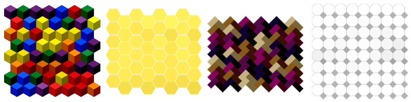

# QuickVectors.Patterns.FSharp

# Tessellation

This type lets you define a pattern which is based around shapes being tessellated.

- The [Tessellation Type](#the-tessellation-type)
    - [Fields](#fields)
    - [Construction](#construction)
    - [Deconstruction](#deconstruction)
    - [Variations](#variations)
    - [Generation](#generation)
    - [Ready-made Tessellation Patterns](#ready-made-tessellation-patterns)
- [Issues, Questions, and Suggestions](#issues-questions-and-suggestions)



## The Tessellation Type

The `Tessellation` **type** defines a record which is used to specify a tessellation pattern.

### Fields 

The fields of the tessellation pattern are as follows:

| Field Name                | Type                                                                                                  | Purpose / Defines                                     |
| ------------------------- | ----------------------------------------------------------------------------------------------------- | ----------------------------------------------------- |
| **RandomSeed**            | [RandomSeed](../QuickVectors.Core.FSharp/010-RandomSeed.md "The RandomSeed type and module")          | Random seed used to generate random numbers           |
| **Tessellator**           | [Tessellator](../QuickVectors.Core.FSharp/110-Tessellator.md "The Tessellator type and module")       | The tessellator to be used                            |
| **SideLength**            | [SideLength](110-SideLength.md "The SideLength type and module")                                      | The length of the main side of the tessellator        |
| **GridSize**              | [GridSize](../QuickVectors.Core.FSharp/100-GridSize.md "The GridSize type and module")                | Size of the grid                                      |
| **GridRoute**             | [GridRoute](../QuickVectors.Core.FSharp/090-GridRoute.md "The GridRoute type and module")             | Route by which the cells of the grid will be visited  |
| **GridOffset**            | [GridOffset](030-GridOffset.md "The GridOffset type and module") **1*                                 | Offset of the rows                                    |
| **Fill**                  | [FillDefinition](350-FillDefinition.md "The FillDefinition type and module") **1*                     | Fill colours of the shapes                            |
| **FillShadingPolicy**     | [TessellatorShadingPolicy](../QuickVectors.Core.FSharp/120-TessellatorShadingPolicy.md "The TessellatorShadingPolicy type and module") **1*     | How the tessellator shading will be applied to the fill           |
| **Stroke**                | [StrokeDefinition](360-StrokeDefinition.md "The StrokeDefinition type and module") **1*               | Colours and widths of the shape strokes               |
| **StrokeShadingPolicy**   | [TessellatorShadingPolicy](../QuickVectors.Core.FSharp/120-TessellatorShadingPolicy.md "The TessellatorShadingPolicy type and module") **1*     | How the tessellator shading will be applied to the stroke         |
| **BoundaryFrame**         | [FrameDefinition](490-Frames.md "The FrameDefinition type and module") **1*                           | The boundary                                          |

- **1* : An Option field.

> **Notes:**
>
> 1. If you specify `None` for both the Fill and Stroke fields then all of the shapes will be invisible.
>
> 2. You can specify a StrokeDefinition with a ColourScheme of `ColourScheme.allNoColour` to get strokes that will be
in the exported design but not visible.
>
> 3. Some rows, for some tessellators, may be offset from the previous row to avoid gaps between the rows. This
can make it look like there are fewer rows than specified but the count is correct.

Below is an example tessellation pattern where all the values have been chosen manually:

```fsharp 
let rainbowCubes = 
    {   RandomSeed = RandomSeed.generate()
        Tessellator = Tessellator.Isocubes
        SideLength = SideLength.oneHundred
        GridRoute = GridRoute.Cascade  
        GridSize = GridSize.fromColumnsAndRows 7 8 
        GridOffset = None 
        Fill = Some {   FillDefinition.ColourScheme = 
                            StandardPalette.Flags.prideRainbow 
                            |> ColourScheme.RandomFromPalette 
                        Reordering = None 
                        Modification = None 
                        Noise = Some Noise.Moderate }
        FillShadingPolicy = Some TessellatorShadingPolicy.ApplyShading
        Stroke = Some StrokeDefinition.black 
        StrokeShadingPolicy = None
        BoundaryFrame = None }
```

(The above example is the `Tessellation.rainbowCubes` ready-made pattern as mentioned below.)

The shading policy fields are separate from the fill and stroke definitions in order to make it easier to
share those definitions between patterns.

### Construction

There are no construction functions, just specify the fields as you would with any normal F# record.

> **Note:** The contents of some fields may, under certain circumstances:
>
> - not make any noticable difference (e.g. some Profiles are quite similar), or;
> 
> - negate the effect of one or more other fields (e.g. reversing a sequence **and** inverting the values at the same time).
>
> Because of this it is recommended that you experiment with lots of different combinations of field values to find what can be achieved.

### Deconstruction

There are no deconstruction functions for the type itself but you can deconstruct each field with the
deconstruction function appropriate for the type of that field or the fields in that type.

### Variations 

There are no functions for varying the values of the fields but you can, since all field values are type-checked and valid,
change the values in the same way as you would with any F# record.  
For example: `let newRecord = { oldRecord with FieldName = newValue }`.

Some convenience functions are available which can be useful:

- `withNewRandomSeed` : Randomly generates a new random seed;
- `withDifferentTessellator` : Uses a different tessellator;
- `withFrame` : Adds a standard boundary frame to a pattern;
- `withoutFrame` : Removes the frame from a pattern.

```fsharp 
Tessellation.rainbowCubes // A ready-made design.
|> Tessellation.withFrame // With a frame.
```

### Generation 

You can generate the design information for a tessellation pattern by using the
`Tessellation.generate` function, passing in a `Tessellation` type as the only parameter.

You would not usually need to investigate or manipulate the generated design information, rather you would
usually pass the design information into an export function in the `QuickVectors.Export.FSharp` package, like this:

```fsharp 
open System.IO // Required for the File functionality.
open QuickVectors.Patterns.FSharp // Required for generating the design.
open QuickVectors.Export.Svg.FSharp // Required for exporting.

Tessellation.rainbowCubes // A ready-made design.
|> Tessellation.generate // Generate the design.
|> Svg.export SvgExportSettings.standard // Create the SVG text.
|> fun svg -> File.WriteAllText("RainbowCubes.svg", svg) // Save to file.
```

If there is a problem generating or exporting the design then an exception will be raised.
Please report any exceptions along with the circumstances under which they occurred.

> **IMPORTANT:**
>
> 1. The pattern itself does not contain any shapes/elements and is only a 'promise' of a design. Shapes/elements
are only created when you generate the pattern into a design.
>
> 2. When you generate pattern into a design, the random numbers used in the design are 'baked in' at the time
of generation so that if you generate the design again, or export the same design again, you will get the same design
with the same randomness. This allows you to save the parameters used in the pattern for replication at another time.
If you don't want this then you can change the RandomSeed field before (re-)generation.

## Ready-made Tessellation Patterns

The ready-made tessellation patterns available are:

- `rainbowCubes` : A pattern which looks like a wall of coloured '3D' cubes;
- `honeycomb` : A pattern which looks like a yellow-filled honeycomb;
- `honeycombOutline` : A pattern which looks like a yellow-outlined honeycomb;
- `hotelCarpet` : A pattern which looks a bit like a hotel carpet;
- `tiledFloor` : A pattern which looks like a tiled floor.

You can make variations of these ready-made patterns or examine them to give you ideas
for your own patterns.

## Issues, Questions, and Suggestions

You can visit the *[QuickVectors.FSharp](https://github.com/GarryPatchett/QuickVectors.FSharp "Home page for the QuickVectors project")* GitHub repository to report issues, 
ask questions, or make suggestions. You can also read about the changes across different versions in the release notes there.