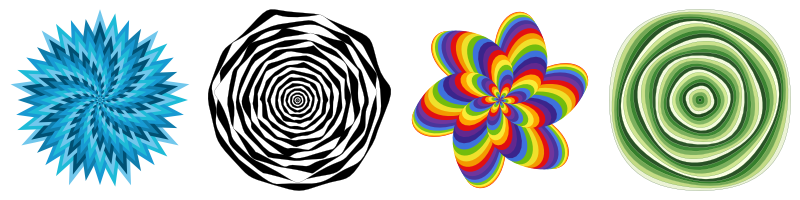

# QuickVectors.Patterns.FSharp

# Centric

This type lets you define a pattern which is based around shapes being rotated around the same centre-point (con**centric** shapes).

- The [Centric Type](#the-centric-type)
    - [Fields](#fields)
    - [Construction](#construction)
    - [Deconstruction](#deconstruction)
    - [Variations](#variations)
    - [Generation](#generation)
    - [Ready-made Centric Patterns](#ready-made-centric-patterns)
- [Issues, Questions, and Suggestions](#issues-questions-and-suggestions)



## The Centric Type

The `Centric` **type** defines a record which is used to specify a centric pattern.

> **Note:** In this package/documentation a 'centric' is currently just a shape, as defined by the Shape field.
They're called 'centrics', rather than 'shapes', because the centrics might, at some point, diverge
from the shapes and so they have a different name to try and avoid confusion in the future. In the meantime,
a centric is just a shape.

### Fields 

The fields of the centric pattern are as follows:

| Field Name                | Type                                                                                                                  | Purpose / Defines                         |
| ------------------------- | --------------------------------------------------------------------------------------------------------------------- | ----------------------------------------- |
| **RandomSeed**            | [RandomSeed](../QuickVectors.Core.FSharp/010-RandomSeed.md "The RandomSeed type and module")                          | Random seed used to generate random numbers |
| **Shape**                 | [Shape](../QuickVectors.Core.FSharp/020-Shape.md "The Shape type and module")                                         | The shape to be used                      |
| **NumberOfCentrics**      | [NumberOfCentrics](120-NumberOfCentrics.md "The NumberOfCentrics type and module")                                    | The number of centrics to generate        |
| **Geometry**              | [GeometryDefinition](310-GeometryDefinition.md "The GeometryDefinition type and module")                              | Geometries of the centrics                |
| **Rotation**              | [CentricRotationDefinition](390-CentricRotationDefinition.md "The CentricRotationDefinition type and module") **1*    | Rotations of the centrics                 |
| **Vertices**              | [VerticesDefinition](330-VerticesDefinition.md "The VerticesDefinition type and module")                              | Vertices of the centrics                  |
| **BoundarySize**          | [BoundarySize](100-BoundarySize.md "The BoundarySize type and module")                                                | The size of the area within which the design will be generated    |
| **Spacing**               | [CentricSpacingDefinition](380-CentricSpacingDefinition.md "The CentricSpacingDefinition type and module")            | The spacing of the centrics               |
| **Fill**                  | [FillDefinition](350-FillDefinition.md "The FillDefinition type and module") **1*                                     | Fill colours of the centrics              |
| **Stroke**                | [StrokeDefinition](360-StrokeDefinition.md "The StrokeDefinition type and module") **1*                               | Colours and widths of the centric strokes |
| **BoundaryFrame**         | [FrameDefinition](490-Frames.md "The FrameDefinition type and module") **1*                                           | The boundary frame                        |
| **ExtentsFrame**          | [FrameDefinition](490-Frames.md "The FrameDefinition type and module") **1*                                           | The extents frame                         |

- **1* : An Option field.

> **Notes:**
>
> 1. If you specify `None` for both the Fill and Stroke fields then all of the centrics will be invisible.
>
> 2. You can specify a StrokeDefinition with a ColourScheme of `ColourScheme.allNoColour` to get strokes that will be
in the exported design but not visible.
>
> 3. The `Rotation` field is defined via a **Centric**RotationDefinition rather than a RotationDefinition as in other patterns.

Below is an example centric pattern where all the values have been chosen manually:

```fsharp 
let frostyStar = 
    {   RandomSeed = RandomSeed.generate()
        Shape = Shape.Star 
        NumberOfCentrics = NumberOfCentrics.fromInt 50 
        Geometry = GeometryDefinition.twentyEightyRandom
        Rotation = IncrementalRotationAmount.fromFloat 10.0
                   |> IncrementalRotation
                   |> Some 
        Vertices = VerticesDefinition.fromSingleInt 9 
        BoundarySize = BoundarySize.thousandByThousand
        Spacing = Profile.HockeyStick
                  |> ProfiledSpacing 
        Fill = StandardPalette.Shades.coolBlue
               |> ColourScheme.CycledFromPalette
               |> FillDefinition.fromColourScheme 
               |> Some 
        Stroke = None
        BoundaryFrame = None
        ExtentsFrame = None }
```

(The above example is the `Centric.frostyStar` ready-made pattern as mentioned below.)

### Construction

There are no construction functions, just specify the fields as you would with any normal F# record.

> **Note:** The contents of some fields may, under certain circumstances:
>
> - not make any noticable difference (e.g. some Profiles are quite similar), or;
> 
> - negate the effect of one or more other fields (e.g. reversing a sequence **and** inverting the values at the same time).
>
> Because of this it is recommended that you experiment with lots of different combinations of field values to find what can be achieved.

### Deconstruction

There are no deconstruction functions for the type itself but you can deconstruct each field with the
deconstruction function appropriate for the type of that field or the fields in that type.

### Variations 

There are no functions for varying the values of the fields but you can, since all field values are type-checked and valid,
change the values in the same way as you would with any F# record.  
For example: `let newRecord = { oldRecord with FieldName = newValue }`.

Some convenience functions are available which can be useful:

- `withNewRandomSeed` : Randomly generates a new random seed;
- `withBothFrames` : Adds both standard frames to a pattern;
- `withoutFrames` : Removes both frames from a pattern.

```fsharp 
Centric.frostyStar // A ready-made design.
|> Centric.withBothFrames // Now with frames.
```

### Generation 

You can generate the design information for a centric pattern by using the
`Centric.generate` function, passing in a `Centric` type as the only parameter.

You would not usually need to investigate or manipulate the generated design information, rather you would
usually pass the design information into an export function in the `QuickVectors.Export.FSharp` package, like this:

```fsharp 
open System.IO // Required for the File functionality.
open QuickVectors.Patterns.FSharp // Required for generating the design.
open QuickVectors.Export.Svg.FSharp // Required for exporting.

Centric.frostyStar // A ready-made design.
|> Centric.generate // Generate the design.
|> Svg.export SvgExportSettings.standard // Create the SVG text.
|> fun svg -> File.WriteAllText("FrostyStar.svg", svg) // Save to file.
```

If there is a problem generating or exporting the design then an exception will be raised.
Please report any exceptions along with the circumstances under which they occurred.

> **IMPORTANT:**
>
> 1. The pattern itself does not contain any shapes/elements and is only a 'promise' of a design. Shapes/elements
are only created when you generate the pattern into a design.
>
> 2. When you generate pattern into a design, the random numbers used in the design are 'baked in' at the time
of generation so that if you generate the design again, or export the same design again, you will get the same design
with the same randomness. This allows you to save the parameters used in the pattern for replication at another time.
If you don't want this then you can change the RandomSeed field before (re-)generation.

## Ready-made Centric Patterns

The ready-made centric patterns available are:

- `frostyStar` : A pattern which looks like a star in winter (ish);
- `hypnoTunnel` : A pattern which looks like a hypnotic tunnel;
- `flowerPower` : A pattern which looks like a 'hippy flower';
- `lookIntoMyEyes` : A pattern which makes your eyes 'go funny' if you look at it for too long.

You can make variations of these ready-made patterns or examine them to give you ideas
for your own patterns.

## Issues, Questions, and Suggestions

You can visit the *[QuickVectors.FSharp](https://github.com/GarryPatchett/QuickVectors.FSharp "Home page for the QuickVectors project")* GitHub repository to report issues, 
ask questions, or make suggestions. You can also read about the changes across different versions in the release notes there.