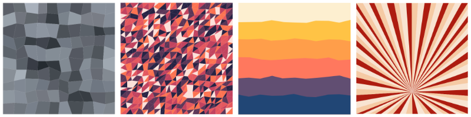

# QuickVectors.Patterns.FSharp

# Pane

This type lets you define a pattern which is based on shapes covering an area.

- The [Pane Type](#the-pane-type)
    - [Fields](#fields)
    - [Construction](#construction)
    - [Deconstruction](#deconstruction)
    - [Variations](#variations)
    - [Generation](#generation)
    - [Ready-made Pane Patterns](#ready-made-pane-patterns)
- [Issues, Questions, and Suggestions](#issues-questions-and-suggestions)



## The Pane Type

The `Pane` **type** defines a record which is used to specify a pane pattern.

### Fields 

The fields of the pane pattern are as follows:

| Field Name                | Type                                                                                              | Purpose / Defines                                             |
| ------------------------- | ------------------------------------------------------------------------------------------------- | ------------------------------------------------------------- |
| **RandomSeed**            | [RandomSeed](../QuickVectors.Core.FSharp/010-RandomSeed.md "The RandomSeed type and module")      | Random seed used to generate random numbers                   |
| **PaneForm**              | [PaneForm](../QuickVectors.Core.FSharp/130-PaneForm.md "The PaneForm type and module")            | The pane form to be used                                      |
| **HorizontalJiggle**      | [JigglePercentage](140-JigglePercentage.md "The JigglePercentage type and module")                | The amount of horizontal jiggle                               |
| **VerticalJiggle**        | [JigglePercentage](140-JigglePercentage.md "The JigglePercentage type and module")                | The amount of vertical jiggle                                 |
| **OmitMidPoints** **1*    | bool                                                                                              | Whether to omit mid-point vertices                            |
| **GridSize**              | [GridSize](../QuickVectors.Core.FSharp/100-GridSize.md "The GridSize type and module")            | Size of the underlying grid                                   |
| **GridRoute**             | [GridRoute](../QuickVectors.Core.FSharp/090-GridRoute.md "The GridRoute type and module")         | Route by which the cells of the grid will be visited          |
| **HorizontalCentre** **2* | [CentrePercentage](150-CentrePercentage.md "The CentrePercentage type and module")                | The relative location of the horizontal centre                |
| **VerticalCentre** **2*   | [CentrePercentage](150-CentrePercentage.md "The CentrePercentage type and module")                | The relative location of the vertical centre                  |
| **BoundarySize**          | [BoundarySize](100-BoundarySize.md "The BoundarySize type and module")                            | The size of the area over which the shapes will be arranged   |
| **StraightTopAndBottom**  | bool                                                                                              | Whether to keep the top and bottom sides of the design straight |
| **StraightLeftAndRight**  | bool                                                                                              | Whether to keep the left and right sides of the design straight |
| **Fill**                  | [FillDefinition](350-FillDefinition.md "The FillDefinition type and module") **3*                 | Fill colours of the shapes                                    |
| **Stroke**                | [StrokeDefinition](360-StrokeDefinition.md "The StrokeDefinition type and module") **3*           | Colours and widths of the shape strokes                       |
| **BoundaryFrame**         | [FrameDefinition](490-Frames.md "The FrameDefinition type and module") **3*                       | The boundary frame                                            |

- **1* : Only appropriate with the PanePosts, PaneRails, and PaneSheets pane forms.
- **2* : Only appropriate with the PaneBlades pane form.
- **3* : An Option field.

> **Notes:**
>
> 1. If you specify `None` for both the Fill and Stroke fields then all of the panes will be invisible.
>
> 2. You can specify a StrokeDefinition with a ColourScheme of `ColourScheme.allNoColour` to get strokes that will be
in the exported design but not visible.

Below is an example pane pattern where all the values have been chosen manually:

```fsharp 
let circus = 
    {   Pane.RandomSeed = RandomSeed.generate() 
        PaneForm = PaneForm.PaneBlades
        HorizontalJiggle = JigglePercentage.fromFloat 10.0 
        VerticalJiggle = JigglePercentage.fromFloat 10.0 
        OmitMidPoints = false 
        GridSize = GridSize.fromColumnsAndRows 18 18 
        GridRoute = GridRoute.Cascade 
        HorizontalCentre = CentrePercentage.fromFloat 50.0 
        VerticalCentre = CentrePercentage.fromFloat 80.0 
        BoundarySize = BoundarySize.thousandByThousand 
        StraightLeftAndRight = true
        StraightTopAndBottom = true 
        Fill = [ Colour.fromHexString "F5CAA4" 
                    Colour.fromHexString "F8E4D2" 
                    Colour.fromHexString "AD1C10" ]
               |> ColourScheme.CycledFrom
               |> FillDefinition.fromColourScheme 
               |> Some 
        Stroke = None 
        BoundaryFrame = None }
```

(The above example is the `Pane.circus` ready-made pattern as mentioned below.)

### Construction

There are no construction functions, just specify the fields as you would with any normal F# record.

> **Note:** The contents of some fields may, under certain circumstances:
>
> - not make any noticable difference (e.g. some Profiles are quite similar), or;
> 
> - negate the effect of one or more other fields (e.g. reversing a sequence **and** inverting the values at the same time).
>
> Because of this it is recommended that you experiment with lots of different combinations of field values to find what can be achieved.

### Deconstruction

There are no deconstruction functions for the type itself but you can deconstruct each field with the
deconstruction function appropriate for the type of that field or the fields in that type.

### Variations 

There are no functions for varying the values of the fields but you can, since all field values are type-checked and valid,
change the values in the same way as you would with any F# record.  
For example: `let newRecord = { oldRecord with FieldName = newValue }`.

Some convenience functions are available which can be useful:

- `withNewRandomSeed` : Randomly generates a new random seed;
- `withDifferentPaneForm` : Uses a different pane form;
- `withMidPoints` : Mid-points are created;
- `withoutMidPoints` : Mid-points are not created;
- `withStraightEdges` : Design will have straight edges;
- `withoutStraightEdges` : Design will not have straight edges;
- `withFrame` : Adds the standard boundary frame to a pattern;
- `withoutFrame` : Removes the frame from a pattern.

```fsharp 
Pane.circus // A ready-made design.
|> Pane.withFrame // Now with a frame.
```

### Generation 

You can generate the design information for a pane pattern by using the
`Pane.generate` function, passing in a `Pane` type as the only parameter.

You would not usually need to investigate or manipulate the generated design information, rather you would
usually pass the design information into an export function in the `QuickVectors.Export.FSharp` package, like this:

```fsharp 
open System.IO // Required for the File functionality.
open QuickVectors.Patterns.FSharp // Required for generating the design.
open QuickVectors.Export.Svg.FSharp // Required for exporting.

Pane.circus // A ready-made design.
|> Pane.generate // Generate the design.
|> Svg.export SvgExportSettings.standard // Create the SVG text.
|> fun svg -> File.WriteAllText("Circus.svg", svg) // Save to file.
```

If there is a problem generating or exporting the design then an exception will be raised.
Please report any exceptions along with the circumstances under which they occurred.

> **IMPORTANT:**
>
> 1. The pattern itself does not contain any shapes/elements and is only a 'promise' of a design. Shapes/elements
are only created when you generate the pattern into a design.
>
> 2. When you generate pattern into a design, the random numbers used in the design are 'baked in' at the time
of generation so that if you generate the design again, or export the same design again, you will get the same design
with the same randomness. This allows you to save the parameters used in the pattern for replication at another time.
If you don't want this then you can change the RandomSeed field before (re-)generation.

## Ready-made Pane Patterns

The ready-made pane patterns available are:

- `flagstones` : A pattern which looks like flagstones;
- `desertSunset` : A pattern which looks like a sunset in the desert;
- `escapeTheCave` : A pattern which looks (a bit) like the view from inside a cave;
- `hiddenTiger` : A pattern which looks like there might be a tiger in there somewhere;
- `circus` : A pattern which looks like the background of a circus poster.

You can make variations of these ready-made patterns or examine them to give you ideas
for your own patterns.

## Issues, Questions, and Suggestions

You can visit the *[QuickVectors.FSharp](https://github.com/GarryPatchett/QuickVectors.FSharp "Home page for the QuickVectors project")* GitHub repository to report issues, 
ask questions, or make suggestions. You can also read about the changes across different versions in the release notes there.